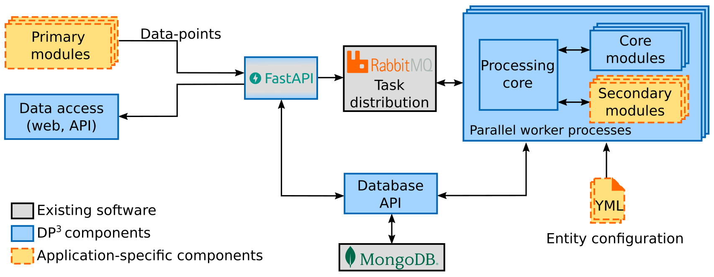
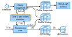

# Architecture

DP³ is generic platform for data processing. 
It's currently used in systems for management of network devices in CESNET, 
but during development we focused on making DP³ as universal as possible.

This page describes the high-level architecture of DP³ and the individual components.

## Data-points

The base unit of data that DP³ uses is called a **data-point**, which looks like this:

```{ .json }
{
  "type": "ip", // (1)!
  "id": "192.168.0.1", // (2)!
  "attr": "open_ports", // (3)!
  "v": [22, 80, 443], // (4)!
  "t1": "2022-08-01T12:00:00", // (5)!
  "t2": "2022-08-01T12:10:00",
  "src": "open_ports_module" // (6)!
}
```

1. A data-point's value belongs to a specific (user-defined) **entity type**, declared by the `type`.
2. The exact entity is using its **entity id** in `id`. 
3. Each entity has multiple defined **attributes**, the `attr` field specifies the attribute of the data-point.
4. Finally, the data-point's **value** is sent in the `v` field.
5. Data-point **validity interval** is defined using the `t1` and `t2` field. 
6. To easily determine the **data source** of this data-point, you can optionally provide an identifier using the `src` field.

This example shows an example of an **observations** data-point (given it has a validity interval),
to learn more about the different types of data-points, please see the [API documentation](../api/#insert-datapoints).

## Platform Architecture  

[//]: # (Using png here to ensure proper logo rendering)
<figure markdown>
  { width="800" id="fig-architecture"}
  <figcaption>DP³ architecture</figcaption>
</figure>

The DP³ architecture as shown in the figure above consists of several components, 
where the DP³ provided components are shown in blue:

- The **HTTP API** (built with Fast API) validates incoming data-points and sends them 
  for processing to the task distribution queues.
  It also provides access to the database for web or scripts.
- The **task distribution** is done using RabbitMQ queues, which distribute tasks between workers.
- The main code of the platform runs in parallel **worker processes**. 
  In the worker processes is a **processing core**,
  which performs all updates and communicates with **core modules** and
  application-specific **secondary modules** when appropriate.
- Both the HTTP API and worker processes use the **database API** to access the entity database,
  currently implemented in MongoDB.
- The **generic web interface**, or a set of generic components has been implemented as
  [Grafana plugin](grafana_plugin.md).
  It's primary use-case is to help quickly and intuitively visualize data while retaining
  genericity.
  Ultimately, web interface is application-specific. However, we wanted to provide a quick start
  alternative.
  Implementation as Grafana plugin also implies option to combine DP³ with other data sources.

The application-specific components, shown in yellow-orange, are as following:


- The **entity configuration** via `yml` files determines the entities and their attributes,
  together with the specifics of platform behavior on these entities. 
  For details of entity configuration, please see the [database entities configuration page](configuration/db_entities.md).
- The distinction between **primary** and **secondary modules** is such that primary modules
  send data-points _into the system_ using the HTTP API, while secondary modules _react
  to the data present in the system_, e.g.: altering the data-flow in an application-specific manner,
  deriving additional data based on incoming data-points or performing data correlation on entity snapshots.
  For primary module implementation, the [API documentation](../api/#insert-datapoints) may be useful, 
  also feel free to check out the dummy_sender script in `/scripts/dummy_sender.py`.
  Feel free to check out the [secondary module API documentation](modules.md), or you can also 
  refer to the [CallbackRegistrar code reference][dp3.common.callback_registrar.CallbackRegistrar] or 
  check out the test modules in `/modules/` or `/tests/modules/`.

## Data flow

This section describes the data flow within the platform.

<figure markdown>
  { width="650" }
  <figcaption>DP³ Data flow</figcaption>
</figure>

The above figure shows a zoomed in view of the worker-process from the [architecture figure](#fig-architecture).
Incoming **Tasks**, which carry data-points from the API, 
are passed to secondary module callbacks configured on new data point, or around entity creation.
These modules may create additional data points or perform any other action. 
When all registered callbacks are processed, the resulting data is written to two collections:
The **data-point (DP) history** collection, where the raw data-points are stored until archivation,
and the **profile history** collection, where a document is stored for each entity id with the relevant history.
You can find these collections in the database under the names `{entity}#raw` and `{entity}#master`.

DP³ periodically creates new profile snapshots, triggered by the Scheduler.
Snapshots take the profile history, and compute the **current value** of the profile, 
reducing each attribute history to a single value. 
The snapshot creation frequency is [configurable](configuration/snapshots.md).
Snapshots are created on a per-entity basis, but all linked entities are processed at the same time.
This means that when snapshots are created, the [registered snapshot callbacks](modules.md#correlation-callbacks)
can access any linked entities for their data correlation needs. 
After all the correlation callbacks are called, the snapshot is written to the **profile snapshot** collection,
for which it can be accessed via the API. The collection is accessible under the name `{entity}#snapshots`.
