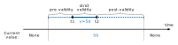
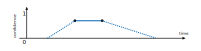
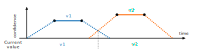
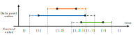
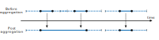
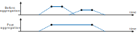
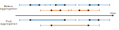

#  History management

Here we explain several concepts that are used to manage data of attributes with history,
meaning they are [observations](data_model.md#observations). The configuration is described in the [History Manager](configuration/history_manager.md) configuration.

DP³ bases its work with these attributes around the idea of the **current value** of the attribute at a given time.
This is how all values are accessible in the [correlation hook API](modules.md#correlation-callbacks) -
DP³ creates a slice for a particular time from the history of each entity,
and presents only these **current values** of all attributes. This is trivial with plain attributes, as they have only one value,
but with observations, it's a bit more complicated.

There is a lot to cover - the different kinds of validity intervals, attributes having confidence,
attributes with overlapping datapoints. 
Also, adjacent datapoints with the same value are merged together,
values are interpolated and extrapolated from nearby data points, etc.
This page describes all this time-related stuff.

## Data point validity

Let's start with the basics.
We will use an example configuration of an attribute to explain the concepts.
Let's use the `speed` attribute from the [example configuration](configuration/db_entities.md):

```yaml
speed:
  name: Speed
  description: Speed of the bus in a particular time. In km/h.
  type: observations
  data_type: float
```

Each data point has a validity interval, which is a time interval in which the value of the attribute is considered to be valid.
This interval is specified in the datapoint itself, by the start and end timestamps, `t1` and `t2`, respectively.
These timestamps should be set to the interval when this value was actually observed, and so 
the value is considered to be valid in the interval `[t1, t2]`, and invalid outside of it.

This basic interval is extended via the `pre_validity` and `post_validity` parameters, specified in the attribute definition.
You can read more about them in the [database entities](configuration/db_entities.md#history-params) section of configuration docs.
Our example attribute has these set to the default `0s`, so let's set them to something else to better showcase this:

```yaml
speed:
  name: Speed
  description: Speed of the bus in a particular time. In km/h.
  type: observations
  data_type: float
  history_params: # (1)!
    pre_validity: 5m
    post_validity: 10m
```

1. Here we added the `history_params` section to the attribute definition, and set the `pre_validity` and `post_validity` parameters to `5m` and `10m`, respectively.

With this configuration, the validity interval of each data point is extended by 5 minutes before and 10 minutes after the interval specified in the data point itself.
In the generic case, the validity interval of a data point with timestamps `t1` and `t2` is `[t1 - pre_validity, t2 + post_validity]`.

This can be visualized like this:

<figure markdown>
  { width="750" }
  <figcaption>Validity intervals for a single datapoint.</figcaption>
</figure>

## Confidence

Let's now add the `confidence` parameter to the attribute definition. 
This parameter specifies whether DP³ should track a confidence value associated with each data point.
The confidence value is a number between 0 and 1, where 0 means the value is completely unreliable (invalid even), and 1 means it's completely reliable.
Now the configuration looks like this:

```yaml
speed:
  name: Speed
  description: Speed of the bus in a particular time. In km/h.
  type: observations
  data_type: float
  confidence: true # (1)!
  history_params:
    pre_validity: 5m
    post_validity: 10m
```

1. Here we added the `confidence: true`, meaning we will send a confidence value with each data point. Let's say the measurement is done using GPS, and we have a confidence value based on the signal strength.

As mentioned, all datapoints should now include a `c` confidence value, which is a number between 0 and 1.
In the interval between `t1` and `t2` of that datapoint, the confidence value is kept constant.
In the `pre` / `post_validity` intervals, the confidence value is linearly interpolated between 0 and the value of `c` in the strict validity interval `[t1, t2]`.
We can see this in action in the following figure:

<figure markdown>
  { width="750" }
  <figcaption>Confidence interpolation for a single datapoint.</figcaption>
</figure>

## Overlapping data points

What happens when we have two data points with overlapping validity intervals? Let's see the following figure:

<figure markdown>
  { width="750" }
  <figcaption>Finding the current value with overlapping datapoint validities.</figcaption>
</figure>

We have two data points, one with value `v1` and the other with value `v2`.
Now, the strict intervals `[t1, t2]` do not overlap, but the extended intervals `[t1 - pre_validity, t2 + post_validity]` do.
As you can see in the figure, the **current value** is considered to be the one, where the interpolated confidence value is higher.

If the attribute had no confidence values as before, the result would be the same,
but the base "fake" confidence value used for the calculation would be always 1.

## Multi-value data points 

Let's have a different example for this one. Let's say we will give each passenger an ID, and want to track what passengers were on the bus at a given time.

```yaml
passengers:
  name: Passengers
  description: IDs of passengers on the bus at a given time.
  type: observations
  data_type: int
  multi_value: true # (1)!
  history_params:
    pre_validity: 5m
    post_validity: 5m
```

1. Here we added the `multi_value: true` parameter, meaning multiple values can be valid at the same time.

The `multi_value` parameter is used to specify whether multiple values can be valid at the same time.
If `multi_value` is set to `true`, DP³ will adapt to this and handle the data points accordingly.
Most importantly, despite the fact that we send single datapoints with a value of type `int`,
the **current value** will be a list of integers, and the **current confidence** will be a list of floats, when enabled.

Let's see an example:

<figure markdown>
  { width="750" }
  <figcaption>Multi-value attribute behavior.</figcaption>
</figure>


Here we can se that we get a list of integers with the current passenger IDs, where each value's history is tracked separately.

In case you had this exact data, but did not set the `multi_value: true` parameter,
the behavior would be getting the current value as a single integer, and the current confidence (when set) as a single float.
The current value would be the one with the highest confidence value.
In case of multiple overlapping data points with equal confidence,
one will be chosen by the current implementation based on the current ordering,
but no exact criteria is defined.

Generally speaking, if `multi_value: false` is set, your input modules are responsible for not sending overlapping datapoints,
otherwise the exact behavior is undefined.

!!! question "Arrays vs Multi-value"
  
    Are you unsure how to model your vector of data into a DP³ attribute? Check out [Arrays vs Multi-value attributes](configuration/db_entities.md#arrays-vs-multi-value-attributes).
      

## Data point merging

To save disk space, DP³ merges ***consecutive*** data points with the same value and overlapping validity intervals.
This is also referred to as data point **aggregation**.
The threshold for what is considered **consecutive** for two data points, `A` and `B`, is defined as
`A.t2 + post_validity >= B.t1 - pre_validity`. 
In other words, as long as there is any overlap between the validity intervals of two data points, they are considered consecutive.

<figure markdown>
  { width="750" }
  <figcaption>Two consecutive datapoints of the same value are merged.</figcaption>
</figure>

This aggregation is performed periodically, so even if the data points arrive out-of-order, they will be merged correctly.

If the values have a confidence set, the resulting confidence will be the average of the two values,
As you can see in the next figure:

<figure markdown>
  { width="750" }
  <figcaption>The confidence of merged datapoints will be averaged.</figcaption>
</figure>


With **multi-value** attributes, this merging happens in the same way, but for each value separately.
This means that if you have two data points with overlapping validity intervals, but different values,
they will not be merged, but will be kept as separate data points.
Data points with the same value will be merged, as before.
This is illustrated in the following figure:

<figure markdown>
  { width="750" }
  <figcaption>Each value of a multi-value attribute will be merged separately.</figcaption>
</figure>

## Other resources

We hope this cleared up the history aspect of data point handling in DP³. What's next?

The configuration of [observations attributes](data_model.md#observations) are described in the 
[DB entities](configuration/db_entities.md#observations-specific-parameters) page,
where you can find the additional [history parameters](configuration/db_entities.md#history-params) configuration description.

How often is datapoint aggregation performed is set in the `history_manager` configuration, 
which is described [here](configuration/history_manager.md).

You can read more about data flow in DP³ and where you can get the **current value** on the 
[Architecture](architecture.md#data-flow) page.