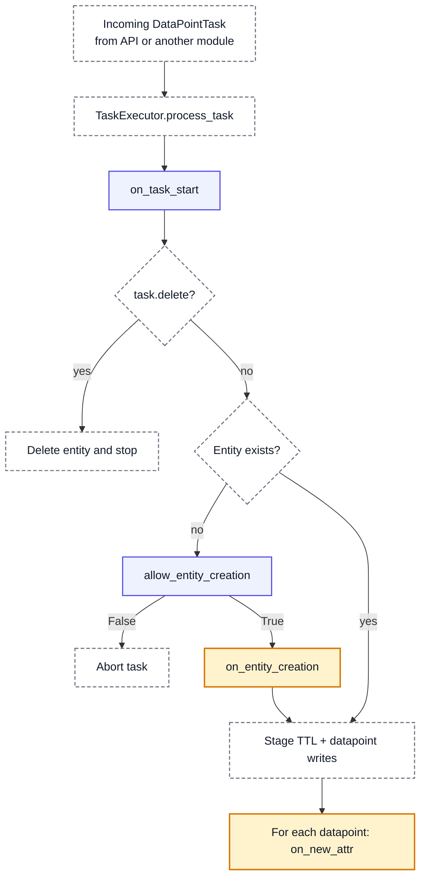
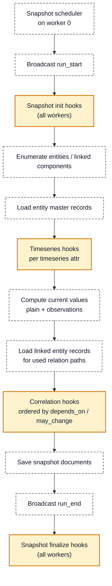
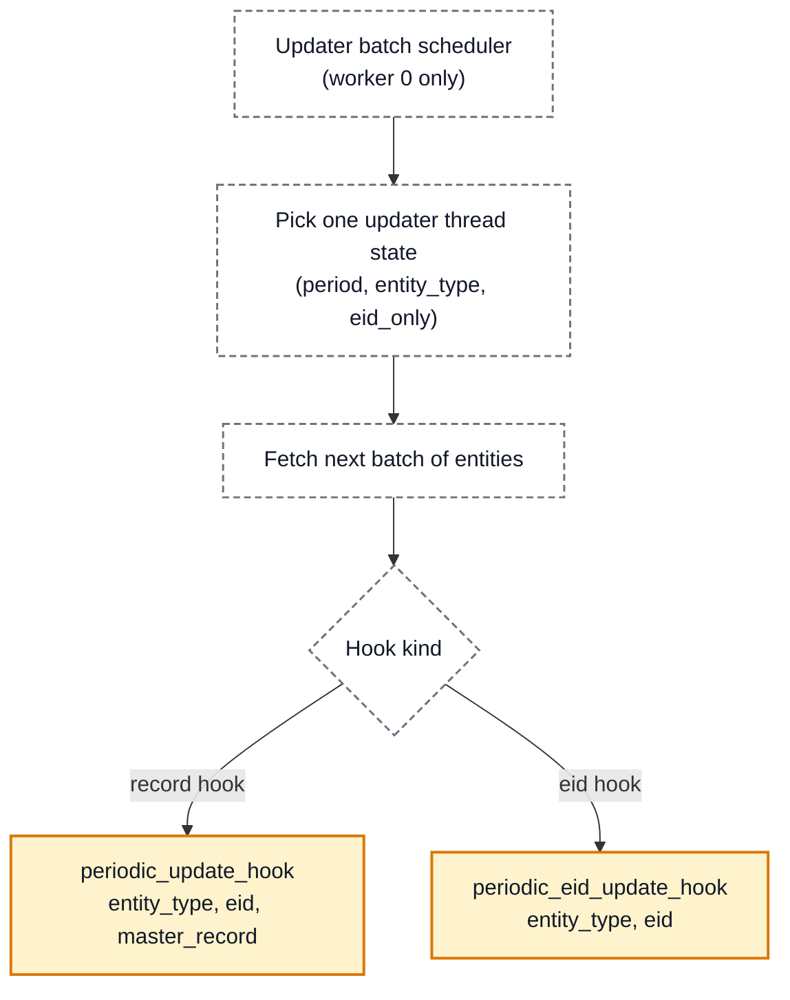

# Module Hook Reference

This page is the reference for the secondary-module callbacks exposed through [`CallbackRegistrar`][dp3.common.callback_registrar.CallbackRegistrar], with emphasis on **when each hook runs**, **what data is available at that moment**, and **how returned tasks re-enter DP3**.

The [Modules](modules.md) page links here for hook behavior and hook selection, while the API reference remains useful for method-level signatures and generated reference details.

## At a glance

DP3 exposes four distinct callback groups:

1. **DataPoint ingestion hooks**: run while a `DataPointTask` is being processed. Use them for
   **immediate reaction to incoming data**: first-seen enrichment, per-attribute derivation,
   admission control, and task-level telemetry.
2. **Snapshot hooks**: run during periodic snapshot creation from data already stored in master
   records. Use them for **snapshot-time fusion and synthesis**: reasoning over the entity's
   current state, often across multiple attributes or linked entities.
3. **Updater hooks**: run periodically over entities already stored in the database. Use them for
   **background revisits of stored entities**: refreshing external enrichments and recomputing
   derived values from stored record history.
4. **Scheduler callbacks**: general CRON-style callbacks, not tied to one entity or one datapoint.
   Use them for **module-level timed maintenance**: reloading shared state, polling, housekeeping,
   or triggering refresh logic that later entity hooks will use.

The most important split is:

- **Ingestion-time** hooks see the incoming task or datapoint.
- **Periodic / already-in-system** hooks see persisted data (`master_record`) or snapshot-time derived values.

## Quick hook placement guide

Use this as a fast way to choose the right hook family.

##### Ingestion
Do you want to react while an incoming `DataPointTask` is being processed? [No?](#snapshots) 

If Yes:

- Run **once when a new entity is first created** → [`register_on_entity_creation_hook(...)`](#entity-on_entity_creation-hook)
- Run for **each incoming datapoint** of a specific attribute → [`register_on_new_attr_hook(...)`](#attribute-on_new_attr-hook)
- **Allow or deny** creation of a new entity → [`register_allow_entity_creation_hook(...)`](#entity-allow_entity_creation-hook)
- Observe **every task** at processing start → [`register_task_hook("on_task_start", ...)`](#task-on_task_start-hook)

##### Snapshots
When data is already in the system, do you want the snapshot-time current state of the entity and linked entities? [No?](#periodic-updates)

If Yes:

- Need the entity's **snapshot-time current values**, possibly including linked entities → [`register_correlation_hook(...)`](#correlation-hooks)
- Need snapshot-time current values **plus** the raw persisted master record → [`register_correlation_hook_with_master_record(...)`](#correlation-hooks)
- Need **whole-run setup** before snapshot processing begins → [`register_snapshot_init_hook(...)`](#snapshot-snapshot_init-hook)
- Need **whole-run teardown** after snapshot processing ends → [`register_snapshot_finalize_hook(...)`](#snapshot-snapshot_finalize-hook)
- Need **timeseries history before it is reduced into snapshot values** → [`register_timeseries_hook(...)`](#snapshot-timeseries_hook)

##### Periodic updates
Do you want to run periodically over entities already stored in the database? [No?](#cron-timer)

If Yes:

- Need only `entity_type` + `eid` → [`register_periodic_eid_update_hook(...)`](#updater-periodic_eid_update_hook)
- Need `entity_type` + `eid` + `master_record` → [`register_periodic_update_hook(...)`](#updater-periodic_update_hook)

##### CRON timer
Do you just need a time-based callback, not tied to an incoming datapoint, snapshot entity, or updater sweep?

   - Yes → [`scheduler_register(...)`](#general-scheduled-callbacks)

## DataPoint ingestion pipeline hooks

Ingestion hooks are the place for **immediate reaction to newly arriving data**. They run while a
`DataPointTask` is being processed, before DP3 moves on to later periodic mechanisms such as
snapshots or updater sweeps.

In real module usage, they are typically used for four distinct kinds of work:

- **entity initialization on first sight**, where the entity ID alone is enough to derive an
  initial enrichment, such as geolocation, reverse-DNS hostname lookup, static labeling, or other
  first-seen attributes,
- **attribute-driven derivation**, where the arrival of one specific datapoint immediately produces
  another datapoint, such as classifying a hostname, deriving labels from open ports, or creating
  links from one entity to another while preserving the incoming datapoint's timing,
- **admission control**, where entity creation is allowed only for entities that match some rule,
  such as a configured prefix filter,
- **task-level observation**, usually for telemetry, metrics, or tracing around task processing
  rather than for deriving entity state.

The practical pattern is that ingestion hooks are chosen when the logic should happen **right away**
from the incoming task or datapoint itself, rather than from a later snapshot view or periodic
revisit of stored entities.

A useful rule of thumb is:

- use `on_entity_creation` for **first-seen entity enrichment or initialization**,
- use `on_new_attr` for **immediate reactions to one incoming attribute**,
- use `allow_entity_creation` for **admission control**, and
- use `on_task_start` mainly for **telemetry or bookkeeping**.

### End-to-end ingestion flow



<div class="diagram-legend">
  <span class="diagram-legend-label">Legend:</span>
  <span class="diagram-legend-item action">pipeline action / decision</span>
  <span class="diagram-legend-item hook">hook</span>
  <span class="diagram-legend-item producer">hook that may emit <code>DataPointTask</code>s</span>
</div>

### Task `on_task_start` hook

Registration API:

```python
registrar.register_task_hook("on_task_start", hook)
```

Expected callback signature:

```python
Callable[[DataPointTask], Any]
```

The return value is ignored, so this hook is suited to observing task processing rather than emitting follow-up datapoints.

This hook runs as the first callback point inside `TaskExecutor.process_task`, and it runs for **every** [`DataPointTask`][dp3.common.task.DataPointTask] that reaches a worker, including tasks with `delete=True`.
The callback receives the full incoming task, so it can inspect `etype`, `eid`, `data_points`, `tags`, `ttl_tokens`, and `delete`.
At this point no entity existence decision has been made yet, no `allow_entity_creation` or `on_entity_creation` hook has run, and no datapoints from the task have been staged into persistence.
In practice, this makes `on_task_start` most useful for metrics, auditing, tracing, and similar task-level bookkeeping.

Real usage examples:
[`on_task_start`](https://github.com/search?q=repo%3ACESNET%2FAmfora+OR+repo%3ACESNET%2FADiCT+OR+repo%3ACESNET%2FNERD2+registrar.register_task_hook%28%22on_task_start%22&type=code)

Code reference: [`register_task_hook`][dp3.common.callback_registrar.CallbackRegistrar.register_task_hook]

### Entity `allow_entity_creation` hook

Registration API:

```python
registrar.register_allow_entity_creation_hook(hook, entity="...")
```

Expected callback signature:

```python
Callable[[AnyEidT, DataPointTask], bool]
```

This hook is called only when the target entity does **not** exist yet.
It runs after `on_task_start` and before any creation side effects, so it is the point where a module can decide whether the entity may be created at all.
The callback receives the `eid` that would be created together with the original incoming `DataPointTask`.
Returning `False` aborts processing before the entity record is created.
Because this decision happens before creation completes, there is no persisted master record yet and no snapshot-time current values are available.

Real usage examples:
[`allow_entity_creation`](https://github.com/search?q=repo%3ACESNET%2FAmfora+OR+repo%3ACESNET%2FADiCT+OR+repo%3ACESNET%2FNERD2+registrar.register_allow_entity_creation_hook%28&type=code)

Code reference: [`register_allow_entity_creation_hook`][dp3.common.callback_registrar.CallbackRegistrar.register_allow_entity_creation_hook]

### Entity `on_entity_creation` hook

Registration API:

```python
registrar.register_on_entity_creation_hook(hook, entity="...")
```

Expected callback signature:

```python
Callable[[AnyEidT, DataPointTask], list[DataPointTask]]
```

This hook is called once for a newly created entity, after `allow_entity_creation` has accepted creation and before the task's datapoints are staged into raw and master persistence.
The callback receives the new `eid` together with the original `DataPointTask` that caused the entity to be created, so it can inspect the incoming datapoints through `task.data_points`.
It should not assume that the entity's new state is already readable as a persisted master record, because the creation-triggering task has not been written through the normal persistence path yet.
The hook may return a list of `DataPointTask` objects, and those tasks are queued back into the ingestion pipeline, where they trigger the usual hooks again.
Because they originate from ingestion, they are pushed to the **priority** task queue.
This registration also supports `refresh=` and `may_change=` for recomputation during module-config refresh; see [Refresh-on-config-change behavior for ingestion hooks](#refresh-on-config-change-behavior-for-ingestion-hooks).

Real usage examples:
[`on_entity_creation`](https://github.com/search?q=repo%3ACESNET%2FAmfora+OR+repo%3ACESNET%2FADiCT+OR+repo%3ACESNET%2FNERD2+registrar.register_on_entity_creation_hook%28&type=code)

Code reference: [`register_on_entity_creation_hook`][dp3.common.callback_registrar.CallbackRegistrar.register_on_entity_creation_hook]

### Attribute `on_new_attr` hook

Registration API:

```python
registrar.register_on_new_attr_hook(hook, entity="...", attr="...")
```

Expected callback signature:

```python
Callable[[AnyEidT, DataPointBase], Union[None, list[DataPointTask]]]
```

This hook runs after DP3 stages the current task's TTL changes and datapoint writes, and it runs once for **each datapoint** in `task.data_points`.
If a single task contains three datapoints, the hook is invoked three times.
The callback receives the entity `eid` and the exact incoming datapoint object `dp` for the registered attribute.
That datapoint is presented in its original ingestion form: plain datapoints expose the plain value, observation datapoints expose `t1`, `t2`, `v`, and optionally `c`, and timeseries datapoints expose the incoming chunk payload.
DP3 stages the writes before calling `on_new_attr`, but the database flush itself is buffered and asynchronous, so the new datapoint is always available in `dp` even if an immediate independent database read still lags behind the in-memory staged state.
The hook may return `None` or a list of `DataPointTask` objects to be re-ingested.
As with `on_entity_creation`, this registration also supports `refresh=` and `may_change=` for recomputation during module-config refresh; see [Refresh-on-config-change behavior for ingestion hooks](#refresh-on-config-change-behavior-for-ingestion-hooks).

Real usage examples:
[`on_new_attr`](https://github.com/search?q=repo%3ACESNET%2FAmfora+OR+repo%3ACESNET%2FADiCT+OR+repo%3ACESNET%2FNERD2+registrar.register_on_new_attr_hook%28&type=code)

Code reference: [`register_on_new_attr_hook`][dp3.common.callback_registrar.CallbackRegistrar.register_on_new_attr_hook]

### Data available during ingestion

For reference, the ingestion pipeline works with these data objects:

#### Incoming `DataPointTask`

```python
DataPointTask(
    etype="device",
    eid="dev-123",
    data_points=[...],
    tags=[...],
    ttl_tokens={...},
    delete=False,
)
```

#### Incoming `DataPointBase` passed to `on_new_attr`

Conceptually, this object contains `etype`, `eid`, `attr`, `src`, and `v`, and for historical datapoints it also carries `t1`, `t2`, and possibly `c`.

### Special ingestion cases

#### Delete tasks

If `task.delete` is `True`, `on_task_start` still runs and entity deletion is performed, but `allow_entity_creation`, `on_entity_creation`, and `on_new_attr` do **not** run.

#### Returned tasks recurse through the same pipeline

Any `DataPointTask` returned by `on_entity_creation` or `on_new_attr` is sent back to the main task queue and later processed again by `TaskExecutor.process_task`.
In other words, module-generated datapoints re-enter DP3 exactly like primary datapoints from the API, so they can trigger `on_task_start`, `allow_entity_creation`, `on_entity_creation`, `on_new_attr`, and later snapshot or updater hooks.

## Snapshot-time hooks: periodic processing over stored data

Snapshot hooks operate on data that is **already in the system**.
They are driven by `SnapShooter`, not by the live task currently being ingested.

### Snapshot run flow



<div class="diagram-legend">
  <span class="diagram-legend-label">Legend:</span>
  <span class="diagram-legend-item action">pipeline action / orchestration step</span>
  <span class="diagram-legend-item producer">hook that may emit <code>DataPointTask</code>s</span>
</div>

### Snapshot `snapshot_init` hook

Registration API:

```python
registrar.register_snapshot_init_hook(hook)
```

Expected callback signature:

```python
Callable[[], list[DataPointTask]]
```

This hook runs after a snapshot run starts and before any snapshot tasks for that run are processed.
Because the run-start message is broadcast, it runs once per worker.
The callback receives no arguments and must obtain any context it needs on its own.
It is therefore best suited to preparing shared state before correlation callbacks for that snapshot run.
The hook may return `list[DataPointTask]`, which are queued into the main task queue.

Real usage examples:
[`snapshot_init`](https://github.com/search?q=repo%3ACESNET%2FAmfora+OR+repo%3ACESNET%2FADiCT+OR+repo%3ACESNET%2FNERD2+registrar.register_snapshot_init_hook%28&type=code)

Code reference: [`register_snapshot_init_hook`][dp3.common.callback_registrar.CallbackRegistrar.register_snapshot_init_hook]

### Snapshot `timeseries_hook`

Registration API:

```python
registrar.register_timeseries_hook(hook, entity_type="...", attr_type="...")
```

Expected callback signature:

```python
Callable[[str, str, list[dict]], list[DataPointTask]]
```

This hook runs during snapshot creation, before current values are materialized for the entity, and it is invoked for each registered timeseries attribute that is present in the entity master record.
The callback receives `entity_type`, `attr_type`, and `attr_history`, where `attr_history` is the raw stored history for that attribute from the master record.
It does not receive a `DataPointTask`, a single incoming datapoint, or a snapshot `current_values` dictionary.
Its role is to process accumulated history into derived plain or observation datapoints that later snapshot-time hooks can use.
The hook may return `list[DataPointTask]`.
Those tasks are queued back into ingestion, and DP3 also attempts to fold same-entity outputs into the in-memory snapshot-preparation path before correlation hooks run, so timeseries-derived values may influence the same snapshot run.

Real usage examples:
[`timeseries_hook`](https://github.com/search?q=repo%3ACESNET%2FAmfora+OR+repo%3ACESNET%2FADiCT+OR+repo%3ACESNET%2FNERD2+registrar.register_timeseries_hook%28&type=code)

Code reference: [`register_timeseries_hook`][dp3.common.callback_registrar.CallbackRegistrar.register_timeseries_hook]

### Correlation hooks

Registration APIs:

```python
registrar.register_correlation_hook(...)
registrar.register_correlation_hook_with_master_record(...)
```

Expected callback signatures:

```python
Callable[[str, dict], Union[None, list[DataPointTask]]]
Callable[[str, dict, dict], Union[None, list[DataPointTask]]]
```

In practice, correlation hooks are the place for **snapshot-time fusion and synthesis**.
They are used when a module needs to look at the entity as a whole and derive a value from a combination of attributes, including attributes pulled in through links.
Typical examples include combining several signals into one derived snapshot attribute, condensing low-level indicators into a higher-level classification, working across linked entities, or exporting selected snapshot-time values after they have already been reduced to the current view.
The `with_master_record` variant is intended for cases where the reduced snapshot view is not sufficient and the module also needs the raw stored record, for example to inspect full history arrays, exact timestamps, or other persistence-oriented details that are not present in `current_values`.

Both registration variants also take `depends_on` and `may_change`, expressed as `list[list[str]]` paths from the registered entity type to the relevant attribute.
For example, `[["hostname"]]` refers to a local attribute, while `[["site", "name"]]` refers to an attribute on an entity reached through the `site` relation.
In practice, `register_correlation_hook(...)` is the right choice when the module wants to reason over the current snapshot state of an entity, while `register_correlation_hook_with_master_record(...)` is the right choice when it needs that snapshot state together with the underlying stored history.
Both variants run during snapshot creation, after current values have been computed from the stored master record and after linked entity records have been loaded for the relation paths used by registered hooks.

Real usage examples:
[`correlation_hook`](https://github.com/search?q=repo%3ACESNET%2FAmfora+OR+repo%3ACESNET%2FADiCT+OR+repo%3ACESNET%2FNERD2+registrar.register_correlation_hook%28&type=code)
[`correlation_hook_with_master_record`](https://github.com/search?q=repo%3ACESNET%2FAmfora+OR+repo%3ACESNET%2FADiCT+OR+repo%3ACESNET%2FNERD2+registrar.register_correlation_hook_with_master_record%28&type=code)

Code reference: [`register_correlation_hook`][dp3.common.callback_registrar.CallbackRegistrar.register_correlation_hook]
[`register_correlation_hook_with_master_record`][dp3.common.callback_registrar.CallbackRegistrar.register_correlation_hook_with_master_record]

#### `current_values` input

The `current_values` dict is the snapshot-time view of the entity.
It always contains `{"eid": <entity_id>}`.
Plain attributes are exposed as their plain value, observation attributes are reduced to their current value at snapshot time, and observations with confidence enabled expose the current confidence in a sibling key named `<attr>#c`.
Relation attributes may contain nested linked records in `record` fields once linked entities have been loaded.

Conceptual example:

```python
{
    "eid": "dev-123",
    "hostname": "edge-01",               # plain attribute
    "ip": "192.0.2.10",                 # current observation value
    "ip#c": 0.93,                         # current confidence
    "site": {                             # relation value
        "eid": "site-prg",
        "record": {
            "eid": "site-prg",
            "name": "Prague",
        },
    },
}
```

`depends_on` and `may_change` are used for **validation**, **dependency ordering**, and **discovering which links must be loaded**.
They do **not** make DP3 skip the hook when a dependency is missing; the hook still runs, and the callback should handle missing keys itself.
Correlation hooks for the same entity type are ordered topologically from their `depends_on` and `may_change` declarations.
Invalid dependency paths, invalid output paths, and dependency cycles raise `ValueError` at registration time.

#### `master_record` input

Only `register_correlation_hook_with_master_record` receives the raw `master_record` as a third argument.

That record is the persisted entity document from `{entity}#master`, for example:

```python
{
    "_id": "dev-123",
    "#hash": 41712,
    "#time_created": "...",
    "hostname": {"v": "edge-01", "ts_last_update": "..."},
    "ip": [
        {"t1": "...", "t2": "...", "v": "192.0.2.10", "c": 0.93},
    ],
    "traffic_ts": [
        {"t1": "...", "t2": "...", "v": [1.2, 3.4]},
    ],
}
```

In short, `current_values` is the snapshot-time interpreted current state, while `master_record` is the raw stored history and persistence representation.

#### What a correlation hook may do

A correlation hook may mutate `current_values` in place to enrich the snapshot being saved, return `list[DataPointTask]` to feed new datapoints back into ingestion, or do both.
This is the main hook family that directly shapes snapshot content.

### Snapshot `snapshot_finalize` hook

Registration API:

```python
registrar.register_snapshot_finalize_hook(hook)
```

Expected callback signature:

```python
Callable[[], list[DataPointTask]]
```

This hook runs after a snapshot run ends.
Because the run-end message is broadcast, it runs once per worker.
The callback receives no arguments.
It is mainly used to finish or clean up snapshot-run state after correlation callbacks have completed, and it may return `list[DataPointTask]` queued into the main task queue.

Real usage examples:
[`snapshot_finalize`](https://github.com/search?q=repo%3ACESNET%2FAmfora+OR+repo%3ACESNET%2FADiCT+OR+repo%3ACESNET%2FNERD2+registrar.register_snapshot_finalize_hook%28&type=code)

Code reference: [`register_snapshot_finalize_hook`][dp3.common.callback_registrar.CallbackRegistrar.register_snapshot_finalize_hook]

## Refresh-on-config-change behavior for ingestion hooks

Two ingestion hooks have an extra refresh mode: `register_on_entity_creation_hook(..., refresh=..., may_change=...)` and `register_on_new_attr_hook(..., refresh=..., may_change=...)`.
When `refresh` is supplied, DP3 also registers an internal snapshot correlation wrapper, so a later module-config refresh can cause these hooks to be re-executed during a snapshot run.

The important practical consequence is that this refresh path does **not** replay the original incoming datapoint stream.
It is a recomputation path over already-known entities during snapshot processing, so hooks using refresh should be able to derive their results from persisted state rather than relying exclusively on ephemeral ingestion-only context.
For `on_entity_creation`, the refresh path re-invokes the hook with the entity `eid` and a synthetic empty `DataPointTask(etype=..., eid=..., data_points=[])` instead of the original creation task.
For `on_new_attr`, the refresh path likewise does not replay an original datapoint payload.
In practice, refresh mode should therefore be reserved for hooks that can recompute from persisted state and do not require the original incoming datapoint contents to be present again.

[Real usages of `refresh=`](https://github.com/search?q=repo%3ACESNET%2FAmfora+OR+repo%3ACESNET%2FADiCT+OR+repo%3ACESNET%2FNERD2+refresh%3D&type=code)

## Periodic updater hooks: periodic processing over master records

Updater hooks revisit entities that are **already stored in DP3**.
In real module usage, they are mainly used either to refresh external enrichments on a schedule or to recompute derived attributes from the entity's stored master record and history.
A common pattern is that an `on_entity_creation` hook performs the initial lookup when the entity first appears, and an updater hook refreshes that enrichment later.
That is how modules such as reverse DNS hostname lookup, DNSBL checks, passive DNS enrichment, and Redis-backed blacklist checks are structured: they do the first lookup on entity creation and then revisit the same IP every day or every week.

The two updater variants map cleanly to those common use cases.
`register_periodic_eid_update_hook(...)` is the lighter variant and is used when the module only needs the entity ID to query an external source again.
`register_periodic_update_hook(...)` is used when the module needs the full `master_record` during the periodic sweep, for example to recompute a derived attribute from stored history.
Unlike snapshot hooks, updater hooks do not build snapshot current-value views or load linked entity graphs; instead, they iterate over stored entities over a longer configured period.

### Updater flow



<div class="diagram-legend">
  <span class="diagram-legend-label">Legend:</span>
  <span class="diagram-legend-item action">pipeline action / decision</span>
  <span class="diagram-legend-item producer">hook that may emit <code>DataPointTask</code>s</span>
</div>

### Updater `periodic_update_hook`

Registration API:

```python
registrar.register_periodic_update_hook(hook, hook_id="...", entity_type="...", period="...")
```

Expected callback signature:

```python
Callable[[str, AnyEidT, dict], list[DataPointTask]]
```

This hook runs in updater batches rather than all at once for all entities.
The configured `period` is the time window over which **all entities of that type** should be visited once.
The callback receives `entity_type`, `eid`, and the raw persisted `master_record` for that entity, which is the same persistence-oriented representation described above for correlation hooks with master-record access.
The hook may return `list[DataPointTask]`.
When registering it, `hook_id` must be unique.
It is also important to set `period` realistically for the hook's execution cost; if the period is too short, runs may overlap with later batches and effectively stretch the refresh cadence.

Real usage examples:
[`periodic_update_hook`](https://github.com/search?q=repo%3ACESNET%2FAmfora+OR+repo%3ACESNET%2FADiCT+OR+repo%3ACESNET%2FNERD2+registrar.register_periodic_update_hook%28&type=code)

Code reference: [`register_periodic_update_hook`][dp3.common.callback_registrar.CallbackRegistrar.register_periodic_update_hook]

### Updater `periodic_eid_update_hook`

Registration API:

```python
registrar.register_periodic_eid_update_hook(
    hook,
    hook_id="...",
    entity_type="...",
    period="...",
)
```

Expected callback signature:

```python
Callable[[str, AnyEidT], list[DataPointTask]]
```

This hook follows the same updater scheduling model as `periodic_update_hook`, but it is intended for cases where the callback only needs entity identity and should avoid fetching full records.
The callback therefore receives only `entity_type` and `eid`, and it may return `list[DataPointTask]`.
As with `periodic_update_hook`, `hook_id` must be unique and `period` should be configured realistically so updater batches can complete before the next sweep is due.

Real usage examples:
[`periodic_eid_update_hook`](https://github.com/search?q=repo%3ACESNET%2FAmfora+OR+repo%3ACESNET%2FADiCT+OR+repo%3ACESNET%2FNERD2+registrar.register_periodic_eid_update_hook%28&type=code)

Code reference: [`register_periodic_eid_update_hook`][dp3.common.callback_registrar.CallbackRegistrar.register_periodic_eid_update_hook]

## General scheduled callbacks

`scheduler_register` is the hook for **application-wide time-based jobs**.
In the module examples here, it is not used for per-entity processing at all.
Instead, it is used for background tasks such as reloading external rule files or other shared module state on a schedule.

A representative pattern is that `scheduler_register(...)` periodically reloads some in-memory configuration or auxiliary data, the module updates its shared state or sets a refresh flag, and normal entity hooks then pick up that new state on later processing or refresh runs.
A common example is file-backed labeling or grouping logic: the cron callback reloads labeling rules from files, while the actual per-entity datapoint creation still happens in entity hooks such as `on_entity_creation`.

So, in real usage, scheduler hooks are best thought of as **module-level maintenance or refresh
triggers**, not as a substitute for ingestion hooks, snapshot hooks, or updater sweeps.

Schedules are expressed with CRON-style fields passed to APScheduler's `CronTrigger`, for example `minute="*/10"` for every tenth minute or `minute=0, hour=2` for a daily 02:00 callback.

Registration API:

```python
registrar.scheduler_register(
    func,
    minute="*/10",
    func_args=[...],
    func_kwargs={...},
)
```

The callback runs according to the supplied CRON expression on the local worker's scheduler.
It receives no automatic entity or task context; only the static `func_args` and `func_kwargs` supplied during registration are passed in.
Its return value is ignored by DP3.
In practice, this hook is most useful for housekeeping, external polling, maintenance, metrics emission, periodic cleanup, and similar module-level maintenance work.

Real usage examples:
[`scheduler_register`](https://github.com/search?q=repo%3ACESNET%2FAmfora+OR+repo%3ACESNET%2FADiCT+OR+repo%3ACESNET%2FNERD2+registrar.scheduler_register%28&type=code)

Code reference: [`scheduler_register`][dp3.common.callback_registrar.CallbackRegistrar.scheduler_register]

## Hook outputs and re-entry into DP3

Most user-facing hooks return `list[DataPointTask]`.
Whenever that happens, the returned tasks are fed back into the main ingestion system.

This creates a feedback loop:

```text
hook returns DataPointTask(s)
  -> task queue
  -> TaskExecutor.process_task
  -> ingestion hooks run again
  -> data reaches master/raw storage
  -> later snapshot / updater cycles can see it
```

The queueing path differs slightly by hook family.
Ingestion hooks such as `on_entity_creation` and `on_new_attr` push returned tasks to the priority queue.
Snapshot hooks and updater hooks push returned tasks to the normal task queue.
`scheduler_register` callbacks do not have an automatic task-return path.


## Type of `eid`

!!! tip "Specifying the `eid` type"

    At runtime, the `eid` will be exactly the type as specified in the entity specification.

All the examples on this page show the `eid` as a string, as that is the default type.
The type of the `eid` can be configured in the entity specification, as detailed
[here](configuration/db_entities.md#entity).

The type hint of the `eid` used in callback registration definitions is
[`AnyEidT`][dp3.common.datatype.AnyEidT], which is a type alias of the allowed
`eid` types in the entity specification.
